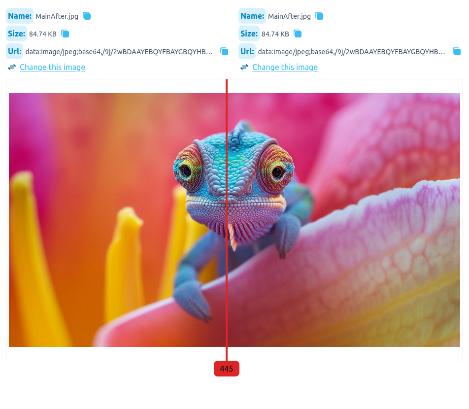
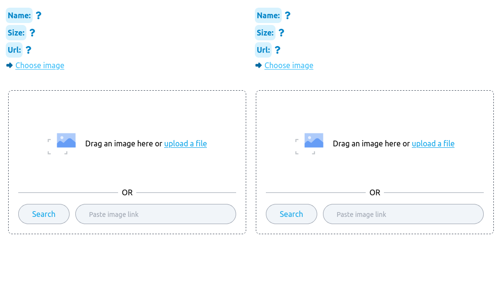
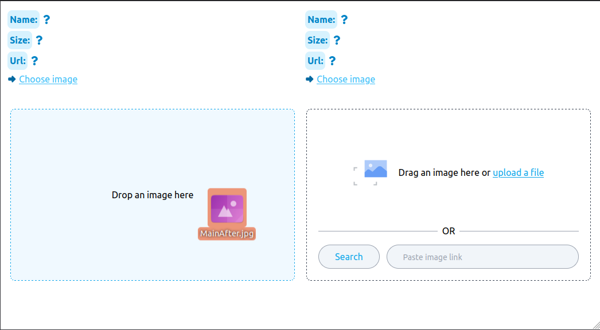
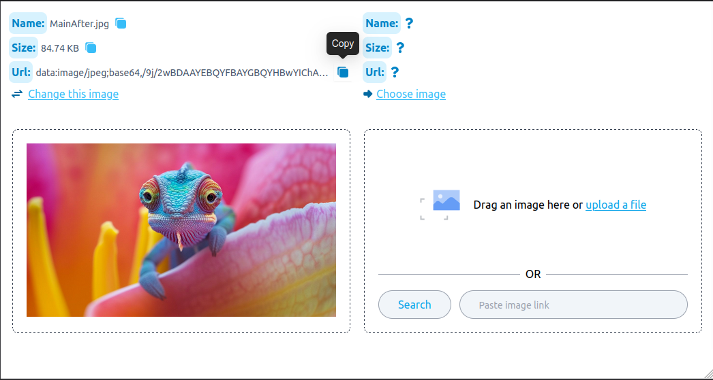
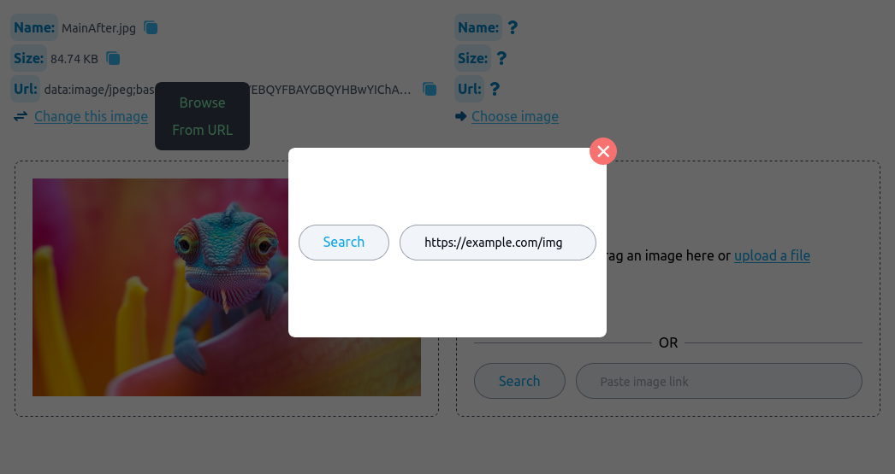
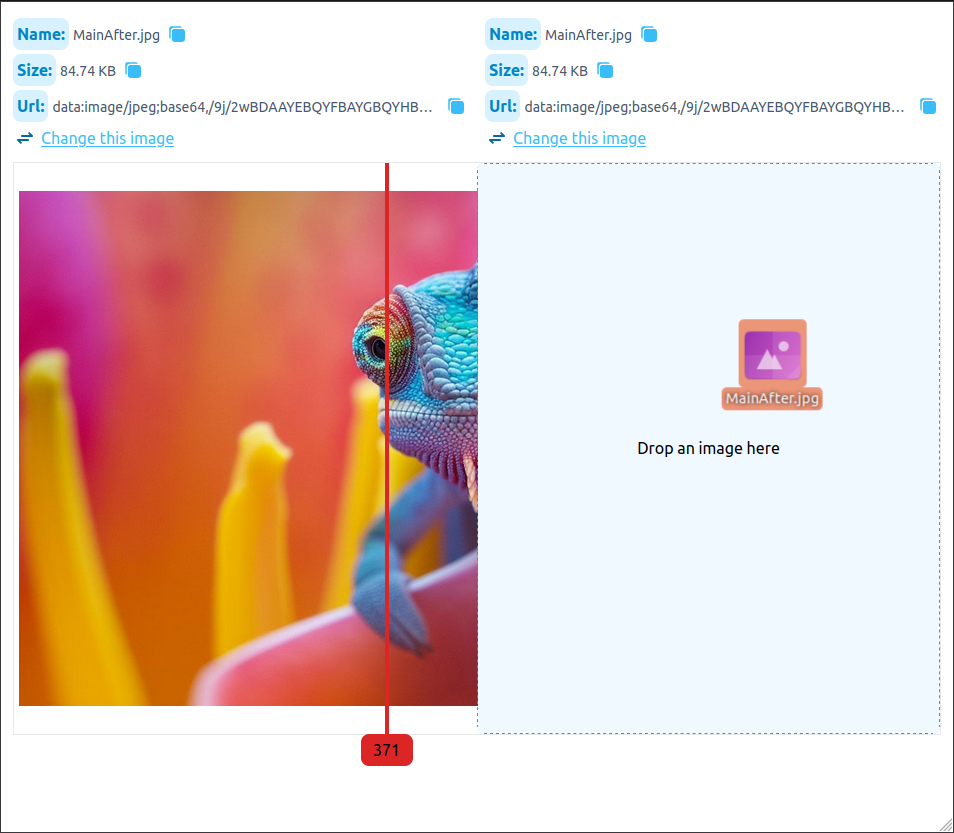

# Image Compare

Images compares app build with React, Typescript, Redux, and more

# Overview

- [Screenshots](#screenshot)
- [Try it :fire:](#try-it)
- [feature](#features)
- [what you can do](#what-you-can-do)
- [Errors and Troubleshooting](#errors-and-troubleshooting)

## Screenshot








# Try it

- get the app

```shell
# fist you need to clone it
git clone https://github.com/abdelrahman-mh/compare-images

# navigate to app
cd compare-images
```

- start the app

```shell
# fist install dependencies
npm install

# run the dev server
npm run dev
```

> this will run the dev server in http://localhost:5173/

# Features

- **Image Selection**

  - Choose images from various sources: left and right sides.
  - Easily drag and drop images.
  - Browse and select images from your local device or via URL.
    - Automatically verifies the URL to ensure it leads to a valid image link.
    - Optimizes performance by caching image data with `Blob` when selecting from a URL, eliminating the need for redundant fetch requests.
  - Select multiple images with ease.
  - Conveniently paste image URLs by clicking anywhere and pressing Ctl+V.
  - Swiftly switch between selected images using various methods: Drag & Drop, URL selection, browsing local files, or Ctl+V.

- **Image Diff Component**

  - Display two selected images side by side.
  - Enhance comparison with a user-friendly diff bar that dynamically adjusts with cursor movement.

- **Error Handling and Notifications**

  - Seamlessly manage errors and provide informative notifications for smooth user experience.

- **Loading Indicators**

  - Keep users informed with loading indicators during data retrieval processes.

- **Pop-up Menu and Tooltips**

  - Intuitively navigate through features with a pop-up menu and tooltips for added convenience.

- **File Size Formatting**

  - Automatically convert file sizes into easily understandable formats (e.g., B, KB, MB, GB, TB) for improved readability.

- **Copy Image Information**
  - Effortlessly copy image details for further use or sharing.

## What You Can Do

Explore the available functionalities and features in the [TO-DO file](./TODOS.md).

# Errors and Troubleshooting

If you encounter a `Network Error`, simply retry, as this may occur due to browser permissions regarding local file access. Subsequent attempts typically resolve this issue.
